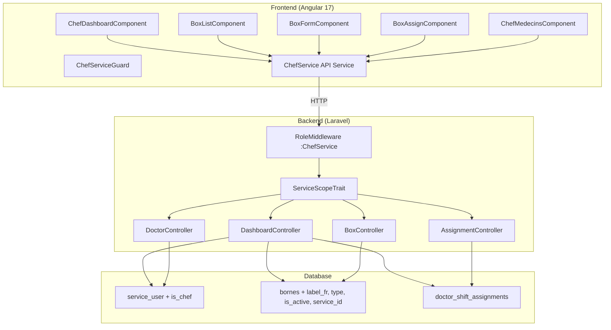

# Design Document: Chef de Service

## Overview

The Chef de Service feature adds a service-level management layer to HealthMap. A user with the `ChefService` role manages exactly one service: configuring consultation boxes, assigning doctors to shifts, and monitoring KPIs. The feature spans three layers:

1. **Database** — Schema extensions to `service_user` (is_chef flag), `bornes` (new columns + service FK), and a new `doctor_shift_assignments` table.
2. **Backend** — A new `ChefService` module under `app/Modules/ChefService/` with dedicated controllers, FormRequests, and a service-scoping middleware trait.
3. **Frontend** — A new `features/chef/` directory with standalone Angular 17 components, a dedicated route guard, and a service for API communication.

The design reuses existing patterns: `BaseResourceController` for CRUD, `RoleMiddleware` for role gating, `roleGuard()` factory for frontend route protection, and shared UI components (`hm-stat-card`, `hm-page-header`, `hm-breadcrumb`).

## Architecture



### Request Flow

1. Frontend guard (`ChefServiceGuard`) checks user has `ChefService` role via `AuthService`.
2. API requests hit `/api/chef/*` routes protected by `role:ChefService` middleware.
3. Each controller uses `ServiceScopeTrait` to resolve the chef's service from the `service_user` pivot (`is_chef = true`) and scope all queries.
4. Responses are JSON, following the existing pagination/resource patterns.

## Components and Interfaces

### Backend Module: `app/Modules/ChefService/`

```
app/Modules/ChefService/
├── Controllers/
│   ├── DashboardController.php
│   ├── BoxController.php
│   ├── AssignmentController.php
│   └── DoctorController.php
├── Requests/
│   ├── StoreBoxRequest.php
│   ├── UpdateBoxRequest.php
│   └── StoreAssignmentRequest.php
├── Traits/
│   └── ServiceScopeTrait.php
└── Models/
    └── DoctorShiftAssignment.php
```

#### ServiceScopeTrait

```php
trait ServiceScopeTrait
{
    protected function chefServiceId(): int
    {
        $pivot = auth()->user()->services()
            ->wherePivot('is_chef', true)
            ->first();

        abort_unless($pivot, 403, 'No chef assignment found.');
        return $pivot->id;
    }

    protected function authorizeServiceAccess(int $serviceId): void
    {
        abort_unless($serviceId === $this->chefServiceId(), 403,
            'Access denied: resource belongs to another service.');
    }
}
```

#### DashboardController

```php
class DashboardController extends Controller
{
    use ServiceScopeTrait;

    public function __invoke(Request $request): JsonResponse
    {
        $serviceId = $this->chefServiceId();

        return response()->json([
            'service_name' => Service::find($serviceId)->name,
            'box_count' => Borne::where('service_id', $serviceId)->count(),
            'doctor_count' => User::whereHas('services', fn($q) =>
                $q->where('services.id', $serviceId)
            )->whereHas('roles', fn($q) =>
                $q->where('role', 'Doctor')
            )->count(),
            'today_patient_count' => WaitingList::where('service_id', $serviceId)
                ->whereDate('added_at', today())->count(),
            'active_consultation_count' => Consultation::where('service_id', $serviceId)
                ->where('status', 'in_progress')->count(),
        ]);
    }
}
```

#### BoxController

Extends `BaseResourceController` with service scoping overrides:

```php
class BoxController extends BaseResourceController
{
    use ServiceScopeTrait;

    protected string $modelClass = Borne::class;
    protected ?string $storeRequest = StoreBoxRequest::class;
    protected ?string $updateRequest = UpdateBoxRequest::class;
    protected array $with = ['assignedDoctor'];

    public function index(Request $request): JsonResponse
    {
        $serviceId = $this->chefServiceId();
        $query = Borne::where('service_id', $serviceId)->with($this->with);
        return response()->json($query->paginate($request->query('per_page', 25)));
    }

    public function store(Request $request): JsonResponse
    {
        $data = app(StoreBoxRequest::class)->validated();
        $data['service_id'] = $this->chefServiceId();
        $box = Borne::create($data);
        return response()->json($box->load($this->with), 201);
    }

    public function update(Request $request, int $id): JsonResponse
    {
        $box = Borne::findOrFail($id);
        $this->authorizeServiceAccess($box->service_id);
        $data = app(UpdateBoxRequest::class)->validated();
        $box->fill($data)->save();
        return response()->json($box->load($this->with));
    }

    public function destroy(int $id): JsonResponse
    {
        $box = Borne::findOrFail($id);
        $this->authorizeServiceAccess($box->service_id);

        if ($box->activeAssignments()->exists()) {
            return response()->json([
                'message' => 'Cannot delete: box has active assignments.'
            ], 422);
        }

        $box->delete();
        return response()->json(null, 204);
    }
}
```

#### AssignmentController

```php
class AssignmentController extends Controller
{
    use ServiceScopeTrait;

    public function store(Request $request, int $boxId): JsonResponse
    {
        $data = app(StoreAssignmentRequest::class)->validated();
        $box = Borne::findOrFail($boxId);
        $this->authorizeServiceAccess($box->service_id);

        $serviceId = $this->chefServiceId();
        // Verify doctor belongs to this service
        $doctorInService = User::whereHas('services', fn($q) =>
            $q->where('services.id', $serviceId)
        )->where('id', $data['user_id'])->exists();

        abort_unless($doctorInService, 403, 'Doctor does not belong to this service.');

        $assignment = DoctorShiftAssignment::create([
            ...$data,
            'service_id' => $serviceId,
            'borne_id' => $boxId,
            'assigned_by' => auth()->id(),
        ]);

        return response()->json($assignment, 201);
    }

    public function destroy(int $id): JsonResponse
    {
        $assignment = DoctorShiftAssignment::findOrFail($id);
        $this->authorizeServiceAccess($assignment->service_id);
        $assignment->delete();
        return response()->json(null, 204);
    }
}
```

#### DoctorController

```php
class DoctorController extends Controller
{
    use ServiceScopeTrait;

    public function index(): JsonResponse
    {
        $serviceId = $this->chefServiceId();

        $doctors = User::whereHas('services', fn($q) =>
            $q->where('services.id', $serviceId)
        )->whereHas('roles', fn($q) =>
            $q->where('role', 'Doctor')
        )->with(['services' => fn($q) => $q->where('services.id', $serviceId)])
         ->get()
         ->map(fn($doctor) => [
             'id' => $doctor->id,
             'name' => $doctor->name . ' ' . $doctor->first_name,
             'assigned_box' => DoctorShiftAssignment::where('user_id', $doctor->id)
                 ->where('service_id', $serviceId)
                 ->where('is_active', true)
                 ->with('borne:id,name,label_ar')
                 ->first()?->borne,
             'schedule_summary' => DoctorShiftAssignment::where('user_id', $doctor->id)
                 ->where('service_id', $serviceId)
                 ->where('is_active', true)
                 ->get(['day_of_week', 'start_time', 'end_time']),
             'is_active' => $doctor->is_active,
         ]);

        return response()->json($doctors);
    }
}
```


### FormRequests

#### StoreBoxRequest

```php
class StoreBoxRequest extends FormRequest
{
    public function rules(): array
    {
        return [
            'label_ar' => ['required', 'string', 'min:1'],
            'label_fr' => ['required', 'string', 'min:1'],
            'type' => ['required', 'in:consultation,observation,urgence'],
            'is_active' => ['boolean'],
        ];
    }
}
```

#### UpdateBoxRequest

```php
class UpdateBoxRequest extends FormRequest
{
    public function rules(): array
    {
        return [
            'label_ar' => ['sometimes', 'string', 'min:1'],
            'label_fr' => ['sometimes', 'string', 'min:1'],
            'type' => ['sometimes', 'in:consultation,observation,urgence'],
            'is_active' => ['sometimes', 'boolean'],
        ];
    }
}
```

#### StoreAssignmentRequest

```php
class StoreAssignmentRequest extends FormRequest
{
    public function rules(): array
    {
        return [
            'user_id' => ['required', 'exists:users,id'],
            'day_of_week' => ['required', 'array', 'min:1'],
            'day_of_week.*' => ['in:lundi,mardi,mercredi,jeudi,vendredi,samedi,dimanche'],
            'start_time' => ['required', 'date_format:H:i'],
            'end_time' => ['required', 'date_format:H:i', 'after:start_time'],
        ];
    }
}
```

### API Endpoints

| Method | Endpoint | Controller | Description |
|--------|----------|------------|-------------|
| GET | `/api/chef/dashboard` | DashboardController | KPI data for chef's service |
| GET | `/api/chef/boxes` | BoxController@index | List boxes in chef's service |
| POST | `/api/chef/boxes` | BoxController@store | Create a new box |
| GET | `/api/chef/boxes/{id}` | BoxController@show | Get single box details |
| PUT | `/api/chef/boxes/{id}` | BoxController@update | Update a box |
| DELETE | `/api/chef/boxes/{id}` | BoxController@destroy | Delete a box |
| GET | `/api/chef/doctors` | DoctorController@index | List doctors in service |
| POST | `/api/chef/boxes/{id}/assignments` | AssignmentController@store | Create shift assignment |
| DELETE | `/api/chef/assignments/{id}` | AssignmentController@destroy | Remove assignment |

### Routes File: `routes/modules/chef.php`

```php
<?php

use Illuminate\Support\Facades\Route;
use App\Modules\ChefService\Controllers\DashboardController;
use App\Modules\ChefService\Controllers\BoxController;
use App\Modules\ChefService\Controllers\AssignmentController;
use App\Modules\ChefService\Controllers\DoctorController;

Route::middleware(['auth', 'role:ChefService'])->prefix('chef')->group(function () {
    Route::get('dashboard', DashboardController::class);
    Route::apiResource('boxes', BoxController::class);
    Route::post('boxes/{box}/assignments', [AssignmentController::class, 'store']);
    Route::delete('assignments/{assignment}', [AssignmentController::class, 'destroy']);
    Route::get('doctors', [DoctorController::class, 'index']);
});
```

### Frontend Module: `features/chef/`

```
frontend/src/app/features/chef/
├── chef.routes.ts
├── chef.service.ts
├── chef.guard.ts
├── dashboard/
│   └── chef-dashboard.component.ts
├── boxes/
│   ├── box-list.component.ts
│   ├── box-form.component.ts
│   └── box-assign.component.ts
└── medecins/
    └── chef-medecins.component.ts
```

#### chef.guard.ts

```typescript
import { inject } from '@angular/core';
import { CanActivateFn, Router } from '@angular/router';
import { AuthService } from '../../core/auth/auth.service';

export const chefServiceGuard: CanActivateFn = () => {
  const auth = inject(AuthService);
  const router = inject(Router);
  const user = auth.currentUser();

  if (!user) return router.parseUrl('/login');

  const userRole = auth.getUserRole();
  if (userRole === 'ChefService') return true;

  // Admin can also access chef routes for oversight
  if (userRole === 'Admin') return true;

  return router.parseUrl('/admin/dashboard');
};
```

#### chef.routes.ts

```typescript
import { Routes } from '@angular/router';
import { chefServiceGuard } from './chef.guard';

export const CHEF_ROUTES: Routes = [
  {
    path: '',
    canActivate: [chefServiceGuard],
    children: [
      { path: '', redirectTo: 'dashboard', pathMatch: 'full' },
      {
        path: 'dashboard',
        loadComponent: () => import('./dashboard/chef-dashboard.component')
          .then(m => m.ChefDashboardComponent),
        title: 'Tableau de bord Chef — HealthMap'
      },
      {
        path: 'boxes',
        loadComponent: () => import('./boxes/box-list.component')
          .then(m => m.BoxListComponent),
        title: 'Boxes — HealthMap'
      },
      {
        path: 'boxes/new',
        loadComponent: () => import('./boxes/box-form.component')
          .then(m => m.BoxFormComponent),
        title: 'Nouvelle Box — HealthMap'
      },
      {
        path: 'boxes/:id/edit',
        loadComponent: () => import('./boxes/box-form.component')
          .then(m => m.BoxFormComponent),
        title: 'Modifier Box — HealthMap'
      },
      {
        path: 'boxes/:id/assign',
        loadComponent: () => import('./boxes/box-assign.component')
          .then(m => m.BoxAssignComponent),
        title: 'Assigner Médecin — HealthMap'
      },
      {
        path: 'medecins',
        loadComponent: () => import('./medecins/chef-medecins.component')
          .then(m => m.ChefMedecinsComponent),
        title: 'Médecins — HealthMap'
      },
    ]
  }
];
```

#### chef.service.ts

```typescript
import { Injectable, inject } from '@angular/core';
import { HttpClient } from '@angular/common/http';
import { environment } from '../../../../environments/environment';
import { Observable } from 'rxjs';

export interface DashboardKpi {
  service_name: string;
  box_count: number;
  doctor_count: number;
  today_patient_count: number;
  active_consultation_count: number;
}

export interface Box {
  id: number;
  label_ar: string;
  label_fr: string;
  type: 'consultation' | 'observation' | 'urgence';
  is_active: boolean;
  service_id: number;
  assigned_doctor?: { id: number; name: string } | null;
}

export interface DoctorShiftAssignment {
  id: number;
  user_id: number;
  service_id: number;
  borne_id: number;
  day_of_week: string[];
  start_time: string;
  end_time: string;
  assigned_by: number;
  is_active: boolean;
}

export interface ServiceDoctor {
  id: number;
  name: string;
  assigned_box: { id: number; name: string; label_ar: string } | null;
  schedule_summary: { day_of_week: string[]; start_time: string; end_time: string }[];
  is_active: boolean;
}

@Injectable({ providedIn: 'root' })
export class ChefService {
  private readonly http = inject(HttpClient);
  private readonly API = `${environment.baseUrl}/chef`;

  // Dashboard
  getDashboard(): Observable<DashboardKpi> {
    return this.http.get<DashboardKpi>(`${this.API}/dashboard`);
  }

  // Boxes
  getBoxes(page = 1, perPage = 25): Observable<{ data: Box[]; total: number }> {
    return this.http.get<any>(`${this.API}/boxes`, { params: { page, per_page: perPage } });
  }

  getBox(id: number): Observable<Box> {
    return this.http.get<Box>(`${this.API}/boxes/${id}`);
  }

  createBox(data: Partial<Box>): Observable<Box> {
    return this.http.post<Box>(`${this.API}/boxes`, data);
  }

  updateBox(id: number, data: Partial<Box>): Observable<Box> {
    return this.http.put<Box>(`${this.API}/boxes/${id}`, data);
  }

  deleteBox(id: number): Observable<void> {
    return this.http.delete<void>(`${this.API}/boxes/${id}`);
  }

  // Assignments
  createAssignment(boxId: number, data: Omit<DoctorShiftAssignment, 'id' | 'service_id' | 'borne_id' | 'assigned_by' | 'is_active'>): Observable<DoctorShiftAssignment> {
    return this.http.post<DoctorShiftAssignment>(`${this.API}/boxes/${boxId}/assignments`, data);
  }

  deleteAssignment(id: number): Observable<void> {
    return this.http.delete<void>(`${this.API}/assignments/${id}`);
  }

  // Doctors
  getDoctors(): Observable<ServiceDoctor[]> {
    return this.http.get<ServiceDoctor[]>(`${this.API}/doctors`);
  }
}
```


## Data Models

### Migration: `2026_05_16_000001_chef_de_service_schema.php`

```php
<?php

use Illuminate\Database\Migrations\Migration;
use Illuminate\Database\Schema\Blueprint;
use Illuminate\Support\Facades\Schema;

return new class extends Migration
{
    public function up(): void
    {
        // 1. Extend service_user pivot with is_chef flag
        Schema::table('service_user', function (Blueprint $table) {
            $table->boolean('is_chef')->default(false)->after('service_id');
        });

        // 2. Extend bornes table
        Schema::table('bornes', function (Blueprint $table) {
            $table->string('label_fr')->nullable()->after('name');
            $table->string('type', 20)->default('consultation')->after('label_fr');
            $table->boolean('is_active')->default(true)->after('type');
            $table->foreignId('service_id')->nullable()->after('is_active')
                ->constrained('services')->nullOnDelete();
        });

        // 3. Create doctor_shift_assignments table
        Schema::create('doctor_shift_assignments', function (Blueprint $table) {
            $table->id();
            $table->foreignId('user_id')->constrained('users')->cascadeOnDelete();
            $table->foreignId('service_id')->constrained('services')->cascadeOnDelete();
            $table->foreignId('borne_id')->constrained('bornes')->cascadeOnDelete();
            $table->json('day_of_week');
            $table->time('start_time');
            $table->time('end_time');
            $table->foreignId('assigned_by')->constrained('users')->cascadeOnDelete();
            $table->boolean('is_active')->default(true);
            $table->timestamps();

            $table->index(['service_id', 'borne_id']);
            $table->index(['user_id', 'is_active']);
        });
    }

    public function down(): void
    {
        Schema::dropIfExists('doctor_shift_assignments');

        Schema::table('bornes', function (Blueprint $table) {
            $table->dropForeign(['service_id']);
            $table->dropColumn(['label_fr', 'type', 'is_active', 'service_id']);
        });

        Schema::table('service_user', function (Blueprint $table) {
            $table->dropColumn('is_chef');
        });
    }
};
```

### Seeder: Add ChefService Role

```php
// In DatabaseSeeder or a dedicated RoleSeeder
Role::firstOrCreate(['role' => 'ChefService']);
```

### Model: DoctorShiftAssignment

```php
<?php

namespace App\Modules\ChefService\Models;

use Illuminate\Database\Eloquent\Model;
use Illuminate\Database\Eloquent\Relations\BelongsTo;
use App\Modules\Auth\Models\User;
use App\Modules\ClinicalCore\Models\Borne;
use App\Modules\ClinicalCore\Models\Service;

class DoctorShiftAssignment extends Model
{
    protected $fillable = [
        'user_id', 'service_id', 'borne_id',
        'day_of_week', 'start_time', 'end_time',
        'assigned_by', 'is_active',
    ];

    protected function casts(): array
    {
        return [
            'day_of_week' => 'array',
            'is_active' => 'boolean',
            'start_time' => 'datetime:H:i',
            'end_time' => 'datetime:H:i',
        ];
    }

    public function user(): BelongsTo
    {
        return $this->belongsTo(User::class);
    }

    public function service(): BelongsTo
    {
        return $this->belongsTo(Service::class);
    }

    public function borne(): BelongsTo
    {
        return $this->belongsTo(Borne::class);
    }

    public function assignedBy(): BelongsTo
    {
        return $this->belongsTo(User::class, 'assigned_by');
    }
}
```

### Extended Borne Model

The existing `Borne` model gains new fillable fields and relationships:

```php
// Added to Borne model
protected $fillable = [
    'name', 'location', 'status', 'establishment_id',
    'label_fr', 'type', 'is_active', 'service_id',
];

protected function casts(): array
{
    return ['is_active' => 'boolean'];
}

public function service(): BelongsTo
{
    return $this->belongsTo(Service::class);
}

public function activeAssignments(): HasMany
{
    return $this->hasMany(DoctorShiftAssignment::class, 'borne_id')
        ->where('is_active', true);
}

public function assignedDoctor(): HasOne
{
    return $this->hasOne(DoctorShiftAssignment::class, 'borne_id')
        ->where('is_active', true)
        ->latestOfMany()
        ->with('user:id,name,first_name');
}
```

### Extended User Model (services pivot)

The `services()` relationship on User gains `withPivot`:

```php
public function services(): BelongsToMany
{
    return $this->belongsToMany(Service::class)->withPivot('is_chef');
}
```

### Entity Relationship Diagram

```mermaid
erDiagram
    users ||--o{ service_user : "belongs to many"
    services ||--o{ service_user : "has many"
    service_user {
        bigint id PK
        bigint user_id FK
        bigint service_id FK
        boolean is_chef
        timestamp created_at
        timestamp updated_at
    }

    services ||--o{ bornes : "has many"
    bornes {
        bigint id PK
        string name
        string label_fr
        string location
        string status
        string type
        boolean is_active
        bigint service_id FK
        bigint establishment_id FK
    }

    users ||--o{ doctor_shift_assignments : "assigned to"
    bornes ||--o{ doctor_shift_assignments : "has shifts"
    services ||--o{ doctor_shift_assignments : "scoped to"
    doctor_shift_assignments {
        bigint id PK
        bigint user_id FK
        bigint service_id FK
        bigint borne_id FK
        json day_of_week
        time start_time
        time end_time
        bigint assigned_by FK
        boolean is_active
        timestamp created_at
        timestamp updated_at
    }
}
```

## Correctness Properties

*A property is a characteristic or behavior that should hold true across all valid executions of a system — essentially, a formal statement about what the system should do. Properties serve as the bridge between human-readable specifications and machine-verifiable correctness guarantees.*

### Property 1: Service-scoped access control

*For any* authenticated user with the `ChefService` role and *for any* API endpoint under `/api/chef/*`, the system SHALL return only resources belonging to the chef's own service (where `is_chef = true` in `service_user`), and SHALL return 403 for any attempt to access, create, update, or delete resources belonging to a different service.

**Validates: Requirements 1.4, 2.5, 3.1, 3.4, 4.7, 5.3, 6.6, 6.7, 7.1, 7.4, 8.1, 8.2, 11.6**

### Property 2: Dashboard KPI correctness

*For any* service state (with varying numbers of boxes, doctors, patients, and consultations), the dashboard endpoint SHALL return counts that exactly match the number of records scoped to that service: `box_count` equals the count of `bornes` with matching `service_id`, `doctor_count` equals the count of users with Doctor role linked via `service_user`, `today_patient_count` equals today's waiting list entries for that service, and `active_consultation_count` equals consultations with status `in_progress` for that service.

**Validates: Requirements 2.2, 2.4**

### Property 3: Chef uniqueness per service

*For any* service, at most one user SHALL have `is_chef = true` in the `service_user` pivot table. Attempting to set `is_chef = true` for a second user in the same service SHALL fail with a validation error.

**Validates: Requirements 1.3**

### Property 4: Box creation stores correct data

*For any* valid box creation payload (non-empty `label_ar`, non-empty `label_fr`, `type` in {consultation, observation, urgence}, optional `is_active` boolean), the created box SHALL have all provided field values stored correctly AND `service_id` set to the chef's own service.

**Validates: Requirements 4.1, 4.6**

### Property 5: Box validation rejects invalid input

*For any* box creation or update payload where `label_ar` is empty/whitespace-only, OR `label_fr` is empty/whitespace-only, OR `type` is not in {consultation, observation, urgence}, the system SHALL reject the request with a 422 validation error.

**Validates: Requirements 4.2, 4.3, 4.4**

### Property 6: Partial update preserves omitted fields

*For any* existing box and *for any* subset of updatable fields provided in an update request, only the provided fields SHALL change while all omitted fields retain their previous values.

**Validates: Requirements 4.5**

### Property 7: Box deletion respects active assignment invariant

*For any* box with zero active assignments (`is_active = true` in `doctor_shift_assignments`), deletion SHALL succeed and the box SHALL no longer exist. *For any* box with one or more active assignments, deletion SHALL fail with a 422 error and the box SHALL remain unchanged.

**Validates: Requirements 5.1, 5.2**

### Property 8: Assignment creation stores correct data

*For any* valid assignment payload (existing doctor in the chef's service, non-empty `day_of_week` array with valid day values, `start_time` < `end_time`), the created `doctor_shift_assignment` record SHALL contain the correct `user_id`, `service_id` matching the chef's service, `borne_id` matching the target box, all provided schedule fields, and `assigned_by` set to the authenticated chef's user ID.

**Validates: Requirements 6.3**

### Property 9: Assignment validation rejects invalid schedules

*For any* assignment payload where `start_time` >= `end_time`, OR `day_of_week` is an empty array, the system SHALL reject the request with a 422 validation error.

**Validates: Requirements 6.4, 6.5**

## Error Handling

| Scenario | HTTP Status | Response Body |
|----------|-------------|---------------|
| Unauthenticated request | 401 | `{ "message": "Unauthenticated." }` |
| User lacks ChefService role | 403 | `{ "message": "Forbidden: You do not have the required role." }` |
| Cross-service access attempt | 403 | `{ "message": "Access denied: resource belongs to another service." }` |
| Doctor not in chef's service | 403 | `{ "message": "Doctor does not belong to this service." }` |
| Validation failure (box fields) | 422 | `{ "message": "...", "errors": { "label_ar": [...], ... } }` |
| Validation failure (assignment) | 422 | `{ "message": "...", "errors": { "start_time": [...], ... } }` |
| Delete box with active assignments | 422 | `{ "message": "Cannot delete: box has active assignments." }` |
| Resource not found | 404 | `{ "message": "Not found." }` |
| No chef assignment for user | 403 | `{ "message": "No chef assignment found." }` |

### Error Handling Strategy

1. **Laravel FormRequest** handles field-level validation (422 responses with structured errors).
2. **ServiceScopeTrait** handles service-level authorization (403 responses).
3. **RoleMiddleware** handles role-level authorization (403 responses).
4. **Controller logic** handles business rules (e.g., active assignment check on delete).
5. **Laravel's exception handler** handles 404 (model not found) and 500 (unexpected errors).

## Testing Strategy

### Unit Tests (PHPUnit)

- **FormRequest tests**: Verify validation rules for `StoreBoxRequest`, `UpdateBoxRequest`, `StoreAssignmentRequest` with specific valid/invalid payloads.
- **ServiceScopeTrait tests**: Verify `chefServiceId()` returns correct ID and `authorizeServiceAccess()` aborts for wrong service.
- **Model relationship tests**: Verify `Borne::activeAssignments()`, `DoctorShiftAssignment` relationships.

### Property-Based Tests (Pest + Faker)

Property-based testing is appropriate for this feature because:
- The authorization logic (service scoping) must hold across all possible user/service/resource combinations.
- Box validation must reject all invalid inputs, not just specific examples.
- The partial update behavior must preserve fields regardless of which subset is provided.
- The deletion invariant must hold regardless of the number/state of assignments.

**Configuration**: Each property test runs minimum 100 iterations using Pest's `repeat()` or a custom property-testing helper with Faker-generated data.

**Tag format**: `Feature: chef-de-service, Property {N}: {title}`

| Property | Test File | Iterations |
|----------|-----------|------------|
| Property 1: Service-scoped access control | `tests/Feature/ChefService/ServiceScopeTest.php` | 100 |
| Property 2: Dashboard KPI correctness | `tests/Feature/ChefService/DashboardKpiTest.php` | 100 |
| Property 3: Chef uniqueness per service | `tests/Feature/ChefService/ChefUniquenessTest.php` | 100 |
| Property 4: Box creation stores correct data | `tests/Feature/ChefService/BoxCreationTest.php` | 100 |
| Property 5: Box validation rejects invalid input | `tests/Feature/ChefService/BoxValidationTest.php` | 100 |
| Property 6: Partial update preserves omitted fields | `tests/Feature/ChefService/BoxPartialUpdateTest.php` | 100 |
| Property 7: Box deletion respects active assignments | `tests/Feature/ChefService/BoxDeletionTest.php` | 100 |
| Property 8: Assignment creation stores correct data | `tests/Feature/ChefService/AssignmentCreationTest.php` | 100 |
| Property 9: Assignment validation rejects invalid schedules | `tests/Feature/ChefService/AssignmentValidationTest.php` | 100 |

### Integration Tests

- **Route middleware**: Verify all `/api/chef/*` routes are protected by `role:ChefService`.
- **End-to-end flows**: Create chef user → create box → assign doctor → verify dashboard KPIs.
- **Frontend guard**: Verify `chefServiceGuard` redirects non-ChefService users.

### Frontend Tests (if applicable)

- **Component tests**: Verify `ChefDashboardComponent` renders all KPI cards.
- **Service tests**: Verify `ChefService` API service makes correct HTTP calls.
- **Guard tests**: Verify `chefServiceGuard` allows/denies based on role.
