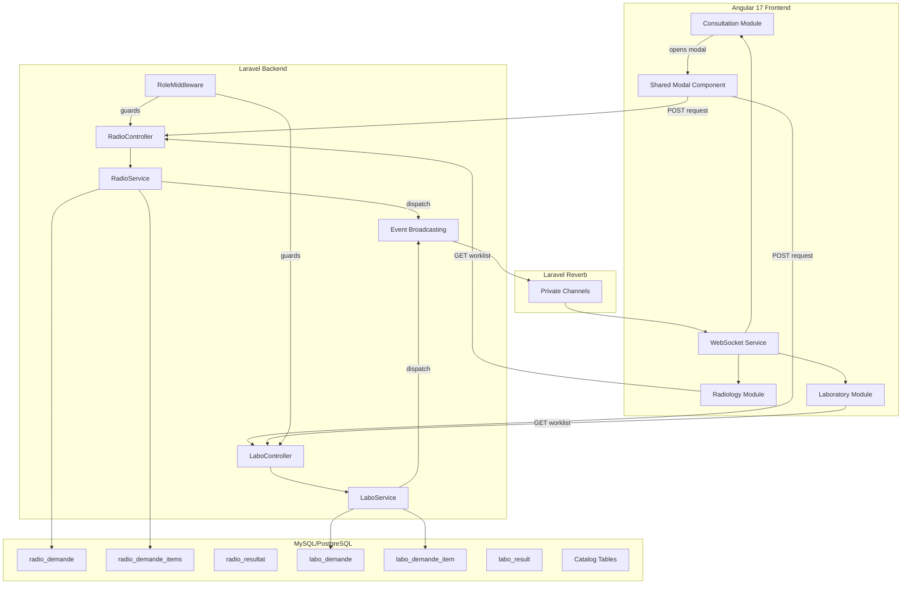
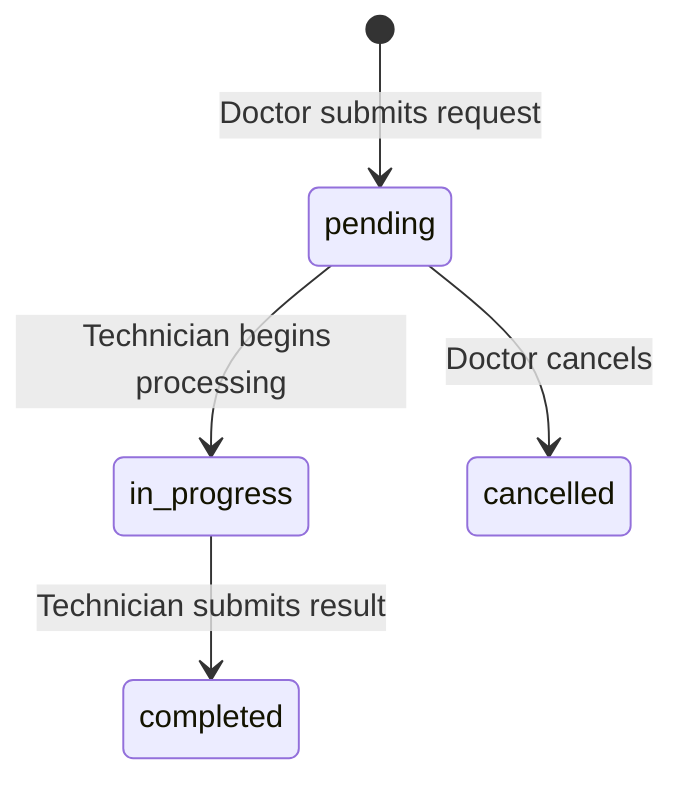
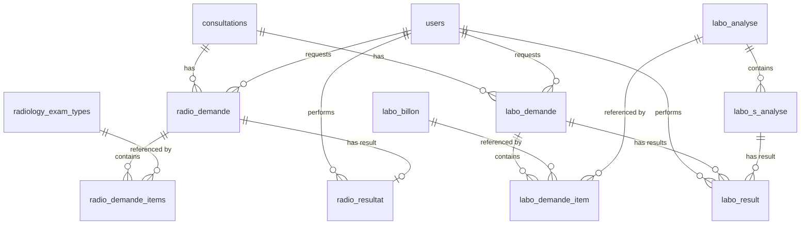

# Design Document: Lab & Radiology Module

## Overview

The Lab & Radiology module extends HealthMap with two symmetric sub-modules — Radiology and Laboratory — that follow an identical request→process→result workflow. The module integrates into the existing consultation flow, allowing Doctors to order exams and view results, while Technicians process requests through dedicated worklists. Real-time WebSocket notifications via Laravel Reverb keep all parties synchronized.

### Key Design Decisions

1. **Symmetric architecture**: Both sub-modules share the same patterns (controllers, services, events, components) to reduce cognitive load and maintenance cost.
2. **Existing module integration**: The module lives under `Backend/app/Modules/ClinicalCore` for models/controllers (extending the existing clinical domain) with dedicated route files for isolation.
3. **Legacy table reuse**: The existing `radiology_exam_types`, `labo_billon`, `labo_analyse`, and `labo_s_analyse` catalog tables are consumed as-is; new tables handle the request/result lifecycle.
4. **Event-driven updates**: Laravel Events + Reverb broadcasting decouple the request/result lifecycle from the notification layer.
5. **Angular standalone components with signals**: Following the established project pattern (Angular 17, Material UI, signals for state).

## Architecture



### Request Lifecycle State Machine



## Components and Interfaces

### Backend Components

#### Controllers

| Controller | Location | Responsibility |
|---|---|---|
| `RadioRequestController` | `Modules/ClinicalCore/Controllers/` | CRUD for radiology requests, cancel endpoint |
| `RadioResultController` | `Modules/ClinicalCore/Controllers/` | Result upload, file download |
| `LaboRequestController` | `Modules/ClinicalCore/Controllers/` | CRUD for laboratory requests, cancel endpoint |
| `LaboResultController` | `Modules/ClinicalCore/Controllers/` | Result entry (partial/complete) |
| `RadioCatalogController` | `Modules/ClinicalCore/Controllers/` | Exam type catalog listing |
| `LaboCatalogController` | `Modules/ClinicalCore/Controllers/` | Panel/analyse/sub-analyse catalog listing |

#### Services

| Service | Responsibility |
|---|---|
| `RadioRequestService` | Business logic for radiology request creation, status transitions, validation |
| `LaboRequestService` | Business logic for lab request creation, item management, status transitions |
| `ExamNotificationService` | Dispatches WebSocket events for both modules |

#### Events

| Event | Channel | Payload |
|---|---|---|
| `ExamRequested` | `radiology` or `laboratory` (private) | request_id, patient_name, exam_summary, urgency, timestamp |
| `ResultReady` | `consultation.{id}` (private) | request_id, patient_name, exam_summary, urgency, timestamp |
| `RequestCancelled` | `radiology` or `laboratory` (private) | request_id, patient_name, timestamp |

#### Form Requests (Validation)

| Request Class | Validates |
|---|---|
| `StoreRadioRequestRequest` | consultation_id exists, exam_type_ids non-empty array of valid IDs, urgency in [normale, urgente], notes optional string |
| `StoreLaboRequestRequest` | consultation_id exists, items non-empty array with valid type+id pairs, urgency in [normale, urgente], notes optional string |
| `StoreRadioResultRequest` | file required with mimes (pdf, jpeg, png, dcm) and max 50MB, compte_rendu optional string |
| `StoreLaboResultRequest` | results array with sub_analysis_id valid, numeric_value required numeric, text_value optional string |

### Frontend Components

| Component | Location | Responsibility |
|---|---|---|
| `ExamRequestModalComponent` | `shared/components/exam-request-modal/` | Shared dialog for both radiology and lab request creation |
| `RadioWorklistComponent` | `features/radiology/` | Radiology technician worklist with filters and real-time updates |
| `RadioRequestDetailComponent` | `features/radiology/` | Request detail view with result upload form |
| `LaboWorklistComponent` | `features/laboratory/` | Laboratory technician worklist with filters and real-time updates |
| `LaboRequestDetailComponent` | `features/laboratory/` | Request detail with result entry form |
| `RadioResultPanelComponent` | `features/consultation/` | Radiology results display in consultation sidebar |
| `LaboResultPanelComponent` | `features/consultation/` | Laboratory results display in consultation sidebar |

#### Angular Services

| Service | Responsibility |
|---|---|
| `RadioService` | HTTP calls to radiology API endpoints, WebSocket subscription for radiology channel |
| `LaboService` | HTTP calls to laboratory API endpoints, WebSocket subscription for laboratory channel |
| `ExamWebSocketService` | Manages Reverb WebSocket connections, channel subscriptions, reconnection logic |

### API Endpoints

#### Radiology

| Method | Path | Auth | Description |
|---|---|---|---|
| `GET` | `/api/radiology/exam-types` | Doctor, Admin | List exam type catalog |
| `POST` | `/api/radiology/requests` | Doctor, Admin | Create radiology request |
| `GET` | `/api/radiology/requests` | RadioTech, Admin | List worklist (filterable) |
| `GET` | `/api/radiology/requests/{id}` | RadioTech, Doctor, Admin | Get request detail |
| `PATCH` | `/api/radiology/requests/{id}/start` | RadioTech, Admin | Transition to in_progress |
| `POST` | `/api/radiology/requests/{id}/result` | RadioTech, Admin | Upload result |
| `GET` | `/api/radiology/results/{id}/download` | Doctor, RadioTech, LabTech, Admin | Download result file |
| `PATCH` | `/api/radiology/requests/{id}/cancel` | Doctor, Admin | Cancel pending request |

#### Laboratory

| Method | Path | Auth | Description |
|---|---|---|---|
| `GET` | `/api/laboratory/catalog` | Doctor, Admin | List panels, analyses, sub-analyses |
| `POST` | `/api/laboratory/requests` | Doctor, Admin | Create laboratory request |
| `GET` | `/api/laboratory/requests` | LabTech, Admin | List worklist (filterable) |
| `GET` | `/api/laboratory/requests/{id}` | LabTech, Doctor, Admin | Get request detail with sub-analyses |
| `PATCH` | `/api/laboratory/requests/{id}/start` | LabTech, Admin | Transition to in_progress |
| `POST` | `/api/laboratory/requests/{id}/results` | LabTech, Admin | Submit results (partial or complete) |
| `PATCH` | `/api/laboratory/requests/{id}/cancel` | Doctor, Admin | Cancel pending request |

## Data Models

### Entity Relationship Diagram



### Table Schemas

#### `radio_demande` (extended)

| Column | Type | Constraints |
|---|---|---|
| `id` | bigint, PK | auto-increment |
| `id_con` | bigint, FK → consultations.id | NOT NULL, indexed |
| `urgency` | enum('normale', 'urgente') | NOT NULL, default 'normale' |
| `status` | enum('pending', 'in_progress', 'completed', 'cancelled') | NOT NULL, default 'pending', indexed |
| `notes` | text | nullable |
| `requested_by` | bigint, FK → users.id | NOT NULL, indexed |
| `cancelled_at` | timestamp | nullable |
| `created_at` | timestamp | NOT NULL |
| `updated_at` | timestamp | NOT NULL |

#### `radio_demande_items` (new pivot)

| Column | Type | Constraints |
|---|---|---|
| `id` | bigint, PK | auto-increment |
| `radio_demande_id` | bigint, FK → radio_demande.id | NOT NULL, ON DELETE CASCADE |
| `radiology_exam_type_id` | bigint, FK → radiology_exam_types.id | NOT NULL |
| `created_at` | timestamp | NOT NULL |
| `updated_at` | timestamp | NOT NULL |

#### `radio_resultat` (extended)

| Column | Type | Constraints |
|---|---|---|
| `id` | bigint, PK | auto-increment |
| `radio_demande_id` | bigint, FK → radio_demande.id | NOT NULL |
| `file_path` | string(500) | nullable |
| `compte_rendu` | text | nullable |
| `performed_by` | bigint, FK → users.id | NOT NULL |
| `status` | enum('pending', 'completed') | NOT NULL, default 'pending' |
| `created_at` | timestamp | NOT NULL |
| `updated_at` | timestamp | NOT NULL |

#### `labo_demande` (new)

| Column | Type | Constraints |
|---|---|---|
| `id` | bigint, PK | auto-increment |
| `id_con` | bigint, FK → consultations.id | NOT NULL, indexed |
| `urgency` | enum('normale', 'urgente') | NOT NULL, default 'normale' |
| `status` | enum('pending', 'in_progress', 'completed', 'cancelled') | NOT NULL, default 'pending', indexed |
| `notes` | text | nullable |
| `requested_by` | bigint, FK → users.id | NOT NULL, indexed |
| `cancelled_at` | timestamp | nullable |
| `created_at` | timestamp | NOT NULL |
| `updated_at` | timestamp | NOT NULL |

#### `labo_demande_item` (new)

| Column | Type | Constraints |
|---|---|---|
| `id` | bigint, PK | auto-increment |
| `labo_demande_id` | bigint, FK → labo_demande.id | NOT NULL, ON DELETE CASCADE |
| `labo_billon_id` | bigint, FK → labo_billon.id | nullable |
| `labo_analyse_id` | bigint, FK → labo_analyse.id | nullable |
| `type` | enum('panel', 'analysis') | NOT NULL |
| `created_at` | timestamp | NOT NULL |
| `updated_at` | timestamp | NOT NULL |

**Constraint**: CHECK (`labo_billon_id` IS NOT NULL AND `labo_analyse_id` IS NULL) OR (`labo_billon_id` IS NULL AND `labo_analyse_id` IS NOT NULL) — enforces XOR.

#### `labo_result` (extended)

| Column | Type | Constraints |
|---|---|---|
| `id` | bigint, PK | auto-increment |
| `labo_demande_id` | bigint, FK → labo_demande.id | NOT NULL |
| `labo_s_analyse_id` | bigint, FK → labo_s_analyse.id | NOT NULL |
| `numeric_value` | decimal(10,4) | nullable |
| `text_value` | text | nullable |
| `performed_by` | bigint, FK → users.id | NOT NULL |
| `created_at` | timestamp | NOT NULL |
| `updated_at` | timestamp | NOT NULL |

### Eloquent Models

| Model | Table | Key Relationships |
|---|---|---|
| `RadioDemande` | radio_demande | belongsTo Consultation, belongsTo User (requestedBy), hasMany RadioDemandeItem, hasOne RadioResultat |
| `RadioDemandeItem` | radio_demande_items | belongsTo RadioDemande, belongsTo RadiologyExamType |
| `RadioResultat` | radio_resultat | belongsTo RadioDemande, belongsTo User (performedBy) |
| `LaboDemande` | labo_demande | belongsTo Consultation, belongsTo User (requestedBy), hasMany LaboDemandeItem, hasMany LaboResult |
| `LaboDemandeItem` | labo_demande_item | belongsTo LaboDemande, belongsTo LaboBillon (nullable), belongsTo LaboAnalyse (nullable) |
| `LaboResult` | labo_result | belongsTo LaboDemande, belongsTo LaboSAnalyse, belongsTo User (performedBy) |

## Correctness Properties

*A property is a characteristic or behavior that should hold true across all valid executions of a system — essentially, a formal statement about what the system should do. Properties serve as the bridge between human-readable specifications and machine-verifiable correctness guarantees.*

### Property 1: Request creation invariant

*For any* valid request payload (radiology or laboratory), creating a request SHALL produce a record where `status` equals `pending`, `requested_by` equals the authenticated user ID, `id_con` references the provided consultation, and `created_at` is set to the current timestamp.

**Validates: Requirements 1.5, 2.6**

### Property 2: Item association completeness

*For any* non-empty set of selected exam items (radiology exam types or laboratory panels/analyses), creating a request SHALL produce exactly N associated item records where N equals the count of selected items, and each item record references the correct catalog entity.

**Validates: Requirements 1.6, 2.7**

### Property 3: Worklist status filtering

*For any* set of request records with mixed statuses (pending, in_progress, completed, cancelled), querying the worklist endpoint SHALL return only records with status `pending` or `in_progress`, and the count of returned records SHALL equal the count of pending + in_progress records in the dataset.

**Validates: Requirements 3.1, 5.1**

### Property 4: Worklist sorting by urgency and date

*For any* set of worklist results, the results SHALL be ordered such that all `urgente` requests appear before all `normale` requests, and within each urgency group, requests are ordered by `created_at` ascending (oldest first).

**Validates: Requirements 3.3, 5.3**

### Property 5: Worklist filtering and search

*For any* filter combination (status, urgency, date range) and search term applied to the worklist, every returned record SHALL match ALL applied filter criteria, and if a patient name search is applied, every returned record's patient name SHALL contain the search term (case-insensitive).

**Validates: Requirements 3.4, 3.5, 5.4, 5.5**

### Property 6: File format validation

*For any* uploaded file, the system SHALL accept the file if and only if its extension is one of {pdf, jpeg, jpg, png, dcm} AND its size is ≤ 50 MB. Files violating either constraint SHALL be rejected with a validation error.

**Validates: Requirements 4.2, 4.3**

### Property 7: Request status lifecycle transitions

*For any* request, the following state transitions SHALL be the only valid transitions: `pending` → `in_progress`, `pending` → `cancelled`, `in_progress` → `completed`. No other transitions SHALL be permitted, and after each transition the record's status SHALL equal the target state.

**Validates: Requirements 4.5, 4.9, 6.4, 6.7, 9.1, 9.2, 9.3**

### Property 8: Partial result entry preserves in_progress status

*For any* laboratory request with N total sub-analyses where N > 1, submitting results for a proper subset (1 to N-1 sub-analyses) SHALL keep the request status as `in_progress` and SHALL create exactly one Labo_Result record per submitted sub-analysis.

**Validates: Requirements 6.8**

### Property 9: Abnormal flag correctness

*For any* laboratory result with a numeric value V and a reference range [min, max], the abnormal flag SHALL be `true` if and only if V < min OR V > max.

**Validates: Requirements 8.3**

### Property 10: Cancellation state guard

*For any* request with status `pending`, cancellation SHALL succeed and set status to `cancelled` with a non-null `cancelled_at` timestamp. *For any* request with status `in_progress` or `completed`, cancellation SHALL be rejected with a 409 Conflict response and the status SHALL remain unchanged.

**Validates: Requirements 9.1, 9.2, 9.3**

### Property 11: Role-based access control

*For any* user with a given role set, accessing a protected endpoint SHALL return 200/201 if the user holds at least one of the endpoint's allowed roles, and SHALL return 403 Forbidden otherwise. The allowed roles per endpoint are: request creation → {Doctor, Admin}, radiology worklist/result → {RadioTech, Admin}, laboratory worklist/result → {LabTech, Admin}, file download → {Doctor, RadioTech, LabTech, Admin}.

**Validates: Requirements 7.5, 11.1, 11.2, 11.3, 11.4, 11.5, 11.6**

### Property 12: Labo_Demande_Item XOR constraint

*For any* Labo_Demande_Item record, exactly one of `labo_billon_id` or `labo_analyse_id` SHALL be non-null. Attempts to create a record with both set or both null SHALL be rejected.

**Validates: Requirements 13.5**

### Property 13: Event payload completeness

*For any* broadcast WebSocket event (ExamRequested, ResultReady, RequestCancelled), the payload SHALL contain: `request_id` (integer), `patient_name` (non-empty string), `exam_summary` (non-empty string), `urgency` (one of 'normale', 'urgente'), and `timestamp` (valid ISO 8601 datetime).

**Validates: Requirements 10.3**

## Error Handling

### Backend Error Strategy

| Scenario | HTTP Status | Response Format |
|---|---|---|
| Validation failure (missing fields, invalid types) | 422 | `{ "message": "...", "errors": { "field": ["rule"] } }` |
| Unauthorized (no auth token) | 401 | `{ "message": "Unauthenticated." }` |
| Forbidden (wrong role) | 403 | `{ "message": "Forbidden: You do not have the required role.", "required_any_of": [...] }` |
| Resource not found | 404 | `{ "message": "..." }` |
| Invalid state transition (e.g., cancel in_progress) | 409 | `{ "message": "Cannot cancel: request is already being processed." }` |
| File too large | 422 | `{ "message": "...", "errors": { "file": ["The file must not be greater than 51200 kilobytes."] } }` |
| File wrong format | 422 | `{ "message": "...", "errors": { "file": ["The file must be a file of type: pdf, jpeg, png, dcm."] } }` |
| Server error | 500 | `{ "message": "Server Error" }` (logged internally) |

### Frontend Error Handling

- **HTTP errors**: Intercepted by a global Angular HTTP interceptor; 401 redirects to login, 403 shows "access denied" toast, 422 maps field errors to form controls, 5xx shows generic error toast.
- **WebSocket disconnection**: `ExamWebSocketService` implements exponential backoff reconnection (1s, 2s, 4s, 8s, max 30s). On reconnection, the active worklist/consultation refreshes data via HTTP to catch missed events.
- **File upload failures**: Progress indicator with retry button; validation errors shown inline on the upload form.

### State Transition Guards

The backend service layer enforces valid state transitions. Invalid transitions (e.g., `completed` → `pending`) throw a domain exception caught by the controller and returned as 409 Conflict. This prevents race conditions where two technicians might try to process the same request.

## Testing Strategy

### Property-Based Testing (PBT)

**Library**: [PHPUnit](https://phpunit.de/) with [Eris](https://github.com/giorgiosironi/eris) (PHP property-based testing library) for backend properties.

**Configuration**: Minimum 100 iterations per property test.

**Tag format**: `Feature: lab-radiology-module, Property {number}: {property_text}`

Properties 1–13 from the Correctness Properties section will each be implemented as a single property-based test. Key generators needed:

- **RequestPayloadGenerator**: Generates valid/invalid combinations of consultation IDs, exam type arrays, urgency values, and notes.
- **StatusGenerator**: Generates request records with random statuses for filtering/transition tests.
- **FileGenerator**: Generates file metadata with random extensions and sizes for validation tests.
- **NumericValueGenerator**: Generates decimal values and reference ranges for abnormal flag testing.
- **RoleGenerator**: Generates user objects with random role combinations for access control tests.

### Unit Tests (Example-Based)

- UI modal opening and catalog display (Requirements 1.1, 2.1)
- Panel expansion showing constituent analyses (Requirement 2.3)
- WebSocket reconnection behavior (Requirement 10.5)
- Badge count display updates (Requirements 7.1, 8.1)
- File download link generation (Requirement 7.4)

### Integration Tests

- WebSocket event dispatch verification (Requirements 1.8, 2.9, 4.6, 6.5, 9.4, 10.1, 10.2)
- Private channel authentication (Requirement 10.4)
- File storage on private disk (Requirement 4.7)
- Database migration smoke tests (Requirements 12.1–12.4, 13.1–13.4)

### End-to-End Tests

- Full workflow: Doctor creates request → Technician sees it in worklist → Technician submits result → Doctor views result
- Cancellation flow: Doctor creates request → Doctor cancels → Technician worklist updates

### Test Organization

```
Backend/tests/
├── Feature/
│   ├── Radiology/
│   │   ├── RadioRequestCreationTest.php
│   │   ├── RadioWorklistTest.php
│   │   ├── RadioResultUploadTest.php
│   │   └── RadioCancellationTest.php
│   └── Laboratory/
│       ├── LaboRequestCreationTest.php
│       ├── LaboWorklistTest.php
│       ├── LaboResultEntryTest.php
│       └── LaboCancellationTest.php
├── Property/
│   ├── RequestCreationPropertyTest.php
│   ├── WorklistFilteringPropertyTest.php
│   ├── WorklistSortingPropertyTest.php
│   ├── StatusLifecyclePropertyTest.php
│   ├── FileValidationPropertyTest.php
│   ├── AbnormalFlagPropertyTest.php
│   ├── CancellationGuardPropertyTest.php
│   ├── AccessControlPropertyTest.php
│   ├── ItemXorConstraintPropertyTest.php
│   └── EventPayloadPropertyTest.php
└── Integration/
    ├── WebSocketBroadcastTest.php
    └── FileStorageTest.php
```
