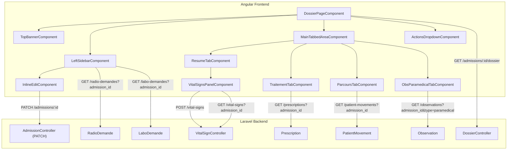

# Design Document: Patient Dossier

## Overview

The Patient Dossier is a comprehensive medical record view for admitted patients within the HealthMap application. It replaces the existing skeleton `admission-resume.component.ts` with a full-featured dossier layout consisting of a top banner, a left sidebar (inside the page body), and a main tabbed content area. The page is accessed via route `/services/:serviceId/admission/:admissionId` when a doctor clicks an occupied bed card.

### Key Design Decisions

1. **Single-page component with child components**: The dossier page is a standalone Angular component that orchestrates child components for each section (banner, sidebar, tabs). This keeps the page cohesive while allowing independent development of each section.

2. **Signal-based state management**: Following the existing project pattern (signals in `AdmissionResumeComponent` and `ServiceComponent`), all reactive state uses Angular signals rather than RxJS BehaviorSubjects.

3. **Parallel data loading**: Primary admission data loads first, then secondary data (vital signs, observations, movements, exam requests) loads in parallel via `forkJoin` to minimize perceived latency.

4. **Backend aggregation endpoint**: A new `GET /api/clinical-core/admissions/:id/dossier` endpoint returns the admission with all nested relationships in a single call, reducing frontend HTTP round-trips for the primary load.

5. **Inline editing pattern**: The motif d'admission uses an inline-edit component with optimistic UI and rollback on failure, following a reusable pattern that can be applied elsewhere.

## Architecture



### Routing

The dossier page is registered at the existing route:
```
/services/:serviceId/admission/:admissionId
```

The route is protected by a role guard allowing `Doctor` and `Admin` roles. The existing `AdmissionResumeComponent` file is replaced in-place with the new `DossierPageComponent`.

## Components and Interfaces

### Frontend Components

| Component | Responsibility | Location |
|-----------|---------------|----------|
| `DossierPageComponent` | Page orchestrator, data loading, layout | `features/services/dossier/dossier-page.component.ts` |
| `TopBannerComponent` | Colored cards with patient/admission/service info | `features/services/dossier/top-banner.component.ts` |
| `LeftSidebarComponent` | Patient metadata, actions, exam requests, history | `features/services/dossier/left-sidebar.component.ts` |
| `MainTabbedAreaComponent` | Tab container with 4 tabs | `features/services/dossier/main-tabbed-area.component.ts` |
| `ResumeTabComponent` | 3-column clinical overview | `features/services/dossier/tabs/resume-tab.component.ts` |
| `VitalSignsPanelComponent` | Vital signs display and entry | `features/services/dossier/tabs/vital-signs-panel.component.ts` |
| `TraitementTabComponent` | Treatment timeline | `features/services/dossier/tabs/traitement-tab.component.ts` |
| `ParcoursTabComponent` | Patient movement history | `features/services/dossier/tabs/parcours-tab.component.ts` |
| `ObsParamedicalTabComponent` | Nursing observation feed | `features/services/dossier/tabs/obs-paramedical-tab.component.ts` |
| `ActionsDropdownComponent` | Clinical actions menu | `features/services/dossier/actions-dropdown.component.ts` |
| `InlineEditComponent` | Reusable inline text editor | `shared/ui/inline-edit/inline-edit.component.ts` |

### Backend Endpoints

| Method | Endpoint | Controller | Purpose |
|--------|----------|-----------|---------|
| `GET` | `/api/clinical-core/admissions/{id}/dossier` | `DossierController@show` | Aggregated admission data with all relationships |
| `PATCH` | `/api/clinical-core/admissions/{id}` | `AdmissionController@update` | Update motif_admission |
| `GET` | `/api/clinical-core/vital-signs` | `VitalSignController@index` | List vital signs for admission |
| `POST` | `/api/clinical-core/vital-signs` | `VitalSignController@store` | Record new vital sign measurement |
| `GET` | `/api/clinical-core/patient-movements` | `PatientMovementController@index` | List movements for admission |
| `GET` | `/api/clinical-core/observations` | `ObservationController@index` | List observations (filterable by type) |
| `GET` | `/api/clinical-core/prescriptions` | `PrescriptionController@index` | List prescriptions for admission |
| `GET` | `/api/radiology/radio-demandes` | `RadioDemandeController@index` | List radiology requests for admission |
| `GET` | `/api/laboratory/labo-demandes` | `LaboDemandeController@index` | List lab requests for admission |

### Key Interfaces (TypeScript)

```typescript
interface DossierData {
  admission: Admission;
  patient: Patient;
  service: Service;
  bed: Bed;
  room: Room;
  companion: Companion | null;
  companions: Companion[];
  treatingDoctor: User | null;
}

interface Admission {
  id: number;
  patient_id: number;
  service_id: number;
  bed_id: number;
  date_admission: string;
  date_sortie: string | null;
  motif_admission: string | null;
  mode: 'normale' | 'urgence' | 'programmee';
  status: 'pending' | 'active' | 'discharged' | 'cancelled';
}

interface Patient {
  id: number;
  patient_matricule: string;
  name: string;
  first_name: string;
  gender: string;
  date_of_birth: string;
  blood_group?: string;
}

interface VitalSign {
  id: number;
  vital_sign_type_id: number;
  admission_id: number;
  patient_id: number;
  value: number;
  measured_at: string;
  type?: VitalSignType;
}

interface VitalSignType {
  id: number;
  label: string;
  unit: string;
  icon: string;
  color: string;
}

interface PatientMovement {
  id: number;
  patient_id: number;
  admission_id: number;
  bed_id: number;
  moved_at: string;
  left_at: string | null;
  reason: string | null;
  bed?: Bed & { room?: Room & { unit?: EstablishmentUnit } };
}

interface ExamRequest {
  id: number;
  admission_id: number;
  status: 'pending' | 'in_progress' | 'completed' | 'cancelled';
  urgency: string;
  notes: string | null;
  created_at: string;
  type: 'radio' | 'labo';
  label: string;
}

interface TreatmentEntry {
  id: number;
  prescription_date: string;
  medication_name: string;
  dosage: string;
  frequency: string;
  doctor_name: string;
}

interface ParamedicalObservation {
  id: number;
  observation_date: string;
  observation_text: string;
  author_name: string;
  type: 'paramedical';
}
```

## Data Models

### Existing Models (No Changes)

| Model | Table | Key Fields |
|-------|-------|-----------|
| `Admission` | `admissions` | patient_id, service_id, bed_id, date_admission, motif_admission, status |
| `Patient` | `patients` | name, first_name, date_of_birth, gender |
| `Companion` | `companions` | name, first_name, phone, address |
| `PatientMovement` | `patient_movements` | admission_id, bed_id, moved_at, left_at, reason |
| `Observation` | `observations` | patient_id, user_id, observation_date, observation_text |
| `Prescription` | `prescriptions` | consultation_id, user_id, prescription_date |
| `PrescriptionMedication` | `prescription_medications` | prescription_id, medication_name, dosage, frequency |
| `RadioDemande` | `radio_demande` | admission_id, radiology_exam_type_id, status, urgency |
| `LaboDemande` | `labo_demande` | admission_id, status, urgency |

### New Model: VitalSign (Controller only — table exists)

The `vital_signs` and `vital_sign_types` tables already exist. A new Eloquent model and controller are needed:

```php
// App\Modules\ClinicalCore\Models\VitalSign
class VitalSign extends Model {
    protected $fillable = [
        'vital_sign_type_id', 'admission_id', 'patient_id',
        'value', 'measured_at', 'measured_by'
    ];

    // Relations: belongsTo VitalSignType, Admission, Patient, User (measured_by)
}

// App\Modules\ClinicalCore\Models\VitalSignType
class VitalSignType extends Model {
    protected $fillable = ['label', 'unit', 'icon', 'color', 'sort_order'];
}
```

### New Endpoint: DossierController

```php
// GET /api/clinical-core/admissions/{id}/dossier
// Returns admission with eager-loaded:
//   - patient (with blood_group if available)
//   - service
//   - bed.room.unit
//   - companion
//   - companions (all for this admission via patient)
//   - latestVitalSigns (most recent per type)
//   - admissionHistory (all admissions for same patient)
```

### IMC Computation

IMC (Body Mass Index) is computed client-side from the most recent height and weight vital signs:

```
IMC = weight_kg / (height_cm / 100)²
```

This is a derived value, not stored in the database.

### Observation Type Extension

The `observations` table needs a `type` column to distinguish medical vs paramedical observations. This will be added via migration:

```sql
ALTER TABLE observations ADD COLUMN type VARCHAR(20) DEFAULT 'medical';
CREATE INDEX idx_observations_type ON observations(type);
```

## Correctness Properties

*A property is a characteristic or behavior that should hold true across all valid executions of a system — essentially, a formal statement about what the system should do. Properties serve as the bridge between human-readable specifications and machine-verifiable correctness guarantees.*

### Property 1: Age computation correctness

*For any* patient with a valid date_of_birth, the computed age displayed in the Top_Banner SHALL equal the floor of the difference in years between the current date and the date_of_birth, accounting for whether the birthday has occurred this year.

**Validates: Requirements 2.1**

### Property 2: Most recent vital sign selection

*For any* admission with one or more vital sign measurements of a given type, the Vital_Signs_Panel SHALL display the measurement with the maximum `measured_at` timestamp for that type.

**Validates: Requirements 5.1**

### Property 3: IMC computation correctness

*For any* valid height measurement (in cm, > 0) and weight measurement (in kg, > 0), the computed IMC SHALL equal `weight / (height / 100)²`, rounded to one decimal place.

**Validates: Requirements 5.2**

### Property 4: Vital sign validation rejects invalid inputs

*For any* non-numeric string or numeric value outside the physiological range for a given vital sign type, the validation function SHALL return an error and the submission SHALL be prevented.

**Validates: Requirements 5.6**

### Property 5: Treatment entries reverse-chronological ordering

*For any* list of treatment entries displayed in the Fiche de Traitement tab, each entry's date SHALL be greater than or equal to the date of the entry that follows it in the display order.

**Validates: Requirements 6.1**

### Property 6: Treatment entry rendering completeness

*For any* treatment entry with valid data, the rendered output SHALL contain the prescription date, medication name, dosage, and prescribing doctor name.

**Validates: Requirements 6.2**

### Property 7: Movement entry rendering completeness

*For any* patient movement entry with valid data, the rendered output SHALL contain the service name, room name, bed number, movement date, and responsible doctor name.

**Validates: Requirements 7.2**

### Property 8: Movement entries chronological ordering

*For any* list of patient movement entries displayed in the Parcours tab, each entry's `moved_at` date SHALL be less than or equal to the `moved_at` date of the entry that follows it in the display order.

**Validates: Requirements 7.3**

### Property 9: Paramedical note rendering completeness

*For any* paramedical observation note with valid data, the rendered output SHALL contain the author name, observation date, and observation text.

**Validates: Requirements 8.2**

### Property 10: Actions dropdown visibility tied to admission status

*For any* admission, the Actions_Dropdown SHALL be visible if and only if the admission status is "active". For statuses "pending", "discharged", or "cancelled", the dropdown SHALL NOT be visible.

**Validates: Requirements 9.1, 9.4**

### Property 11: Admission history descending order

*For any* patient with multiple admissions, the admission history list SHALL display entries ordered by `date_admission` descending, such that each entry's date is greater than or equal to the next entry's date.

**Validates: Requirements 13.1**

## Error Handling

| Scenario | Behavior |
|----------|----------|
| Invalid admission ID (404) | Display error message with link to return to service page |
| Primary data load failure | Show full-page error state with retry button |
| Secondary data load failure (vital signs, observations, etc.) | Show error indicator in the affected section only; other sections render normally |
| Motif PATCH failure | Revert displayed value to previous content, show toast notification with error message |
| Vital sign POST failure | Show validation error inline, keep form values for retry |
| Vital sign validation error (client-side) | Display field-level error message, prevent submission |
| Network timeout | Show timeout-specific error message with retry option |
| Unauthorized access (wrong role) | Redirect to dashboard with "access denied" notification |

### Error State Component Pattern

Each section that loads data independently uses a consistent error state pattern:

```typescript
// Section state: 'loading' | 'loaded' | 'error'
readonly sectionState = signal<'loading' | 'loaded' | 'error'>('loading');
readonly sectionError = signal<string | null>(null);
```

## Testing Strategy

### Unit Tests (Example-Based)

Unit tests cover specific UI interactions, rendering checks, and integration points:

- **Navigation**: Bed card click triggers correct route navigation
- **Data loading**: Component initializes HTTP calls with correct parameters
- **Banner rendering**: Patient name, admission number, service/bed info displayed correctly
- **Sidebar sections**: All sidebar sections render with correct data
- **Tab switching**: Tabs activate correct content panels
- **Inline edit**: Click → edit mode → confirm → PATCH → update cycle
- **Error states**: Each section shows appropriate error UI on failure
- **Role guards**: Doctor and Admin roles allowed, others denied
- **Empty states**: Sections with no data show empty-state messages

### Property-Based Tests

Property-based tests verify universal correctness properties using a PBT library (e.g., `fast-check` for TypeScript):

- **Minimum 100 iterations** per property test
- Each test tagged with: `Feature: patient-dossier, Property {N}: {title}`
- Tests target pure functions and data transformation logic

**Properties to implement:**
1. Age computation (pure function)
2. Most recent vital sign selection (array max-by-date)
3. IMC computation (pure arithmetic)
4. Vital sign validation (input validation function)
5. Treatment reverse-chronological ordering (sort verification)
6. Treatment entry completeness (rendering function)
7. Movement entry completeness (rendering function)
8. Movement chronological ordering (sort verification)
9. Paramedical note completeness (rendering function)
10. Actions dropdown visibility (status → boolean mapping)
11. Admission history ordering (sort verification)

### Integration Tests

Integration tests verify end-to-end flows with the backend:

- Dossier page loads with real admission data
- Vital sign submission persists and reflects in UI
- Motif editing persists via PATCH
- Parallel data loading completes without race conditions

### Test File Structure

```
frontend/src/app/features/services/dossier/
├── dossier-page.component.spec.ts
├── top-banner.component.spec.ts
├── left-sidebar.component.spec.ts
├── actions-dropdown.component.spec.ts
├── tabs/
│   ├── resume-tab.component.spec.ts
│   ├── vital-signs-panel.component.spec.ts
│   ├── traitement-tab.component.spec.ts
│   ├── parcours-tab.component.spec.ts
│   └── obs-paramedical-tab.component.spec.ts
└── __tests__/
    └── dossier.properties.spec.ts   ← Property-based tests
```
