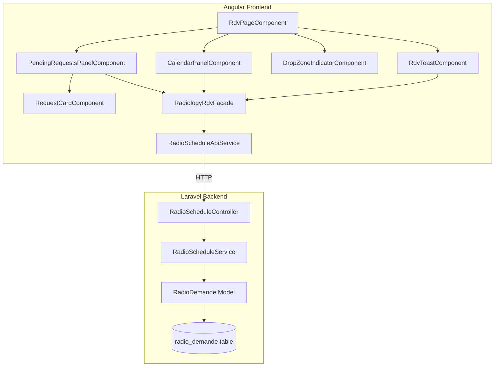
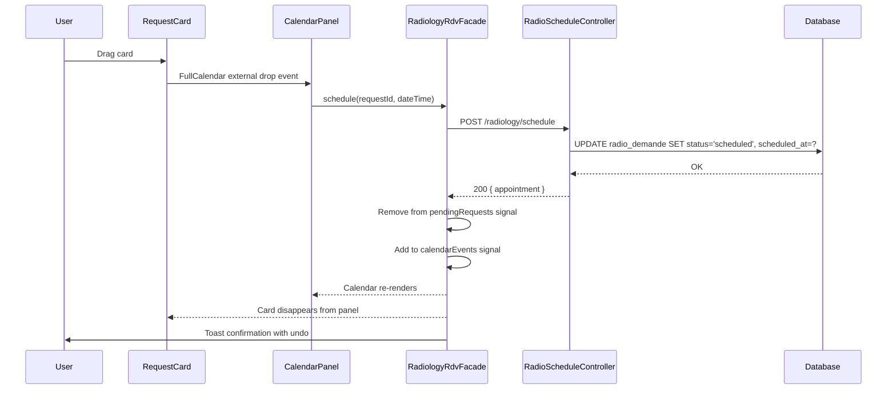
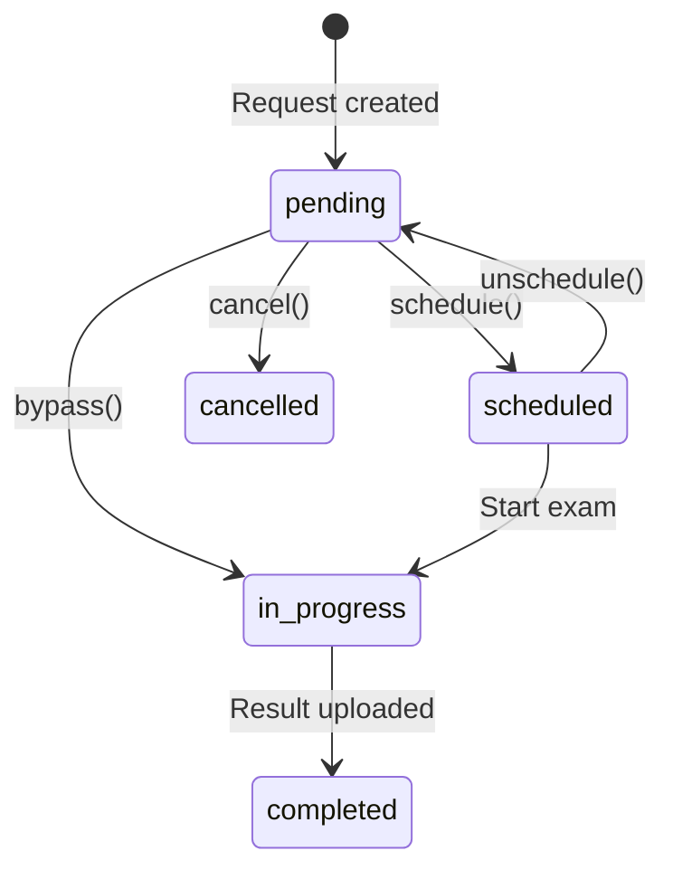

# Design Document: Radiology RDV Scheduling

## Overview

This design describes the technical architecture for the redesigned radiology appointment scheduling page ("Gestion des RDV Radiologie") in the HealthMap hospital management application. The page replaces the existing table-based worklist with a drag-and-drop scheduling interface featuring a left panel of pending requests and a FullCalendar-based time grid.

The solution integrates FullCalendar (@fullcalendar/angular) for the calendar view, uses Angular CDK DragDrop for request card dragging, and introduces a signal-based `RadiologyRdvFacade` service to manage state between the pending panel and calendar. On the backend, a new `RadioScheduleController` provides scheduling, unscheduling, and appointment listing endpoints, extending the existing `RadioDemande` model with `scheduled_at` field.

### Key Design Decisions

| Decision | Choice | Rationale |
|----------|--------|-----------|
| Calendar library | @fullcalendar/angular v6 + interaction plugin | Industry standard, supports external drag, time grid views, Angular 17 compatible |
| Drag mechanism | FullCalendar external drag (Draggable from @fullcalendar/interaction) | Native integration with calendar drop zones, handles time-slot snapping automatically |
| State management | Signal-based RadiologyRdvFacade | Aligns with Angular 17 signals pattern, used in existing worklist component |
| Backend scheduling | New RadioScheduleController + migration adding `scheduled_at` to `radio_demande` | Minimal schema change, reuses existing model |
| Toast notifications | PrimeNG Toast (already in project) | PrimeNG is already a dependency, provides undo-capable toast |

## Architecture



### Data Flow: Schedule Operation



## Components and Interfaces

### Frontend Component Hierarchy

```
RdvPageComponent (shell)
├── hm-page-header (shared, with date nav + view toggle projected)
├── PendingRequestsPanelComponent (left, 300px fixed)
│   ├── RequestsCounterHeaderComponent
│   └── RequestCardComponent[] (draggable)
├── CalendarPanelComponent (right, fluid)
│   ├── DropZoneIndicatorComponent
│   └── FullCalendar (timeGridDay / timeGridWeek / dayGridMonth)
└── RdvToastComponent (overlay)
```

### Component Interfaces

#### RdvPageComponent
```typescript
@Component({ selector: 'app-rdv-page', standalone: true })
export class RdvPageComponent {
  // Injects RadiologyRdvFacade
  // Manages selectedDate signal, currentView signal
  // Provides date navigation (prev/today/next)
  selectedDate = signal<Date>(new Date());
  currentView = signal<'timeGridDay' | 'timeGridWeek' | 'dayGridMonth'>('timeGridDay');
}
```

#### PendingRequestsPanelComponent
```typescript
@Component({ selector: 'app-pending-requests-panel', standalone: true })
export class PendingRequestsPanelComponent {
  // Reads from facade.pendingRequests()
  // Manages urgency filter state
  urgencyFilter = signal<'all' | 'urgente'>('all');
  filteredRequests = computed(() => { /* filter logic */ });
}
```

#### RequestCardComponent
```typescript
@Component({ selector: 'app-request-card', standalone: true })
export class RequestCardComponent {
  request = input.required<RadioDemandeDto>();
  delete = output<number>();
  bypass = output<number>();
  // Implements FullCalendar Draggable via ElementRef
}
```

#### CalendarPanelComponent
```typescript
@Component({ selector: 'app-calendar-panel', standalone: true })
export class CalendarPanelComponent {
  currentView = input.required<string>();
  selectedDate = input.required<Date>();
  events = input.required<CalendarEventDto[]>();
  eventDrop = output<ScheduleDropEvent>();
  // Wraps FullCalendarComponent with options
}
```

#### DropZoneIndicatorComponent
```typescript
@Component({ selector: 'app-drop-zone-indicator', standalone: true })
export class DropZoneIndicatorComponent {
  visible = input.required<boolean>();
}
```

#### RdvToastComponent
```typescript
@Component({ selector: 'app-rdv-toast', standalone: true })
export class RdvToastComponent {
  // Uses PrimeNG MessageService or custom implementation
  // Emits undo action
}
```

### RadiologyRdvFacade Service

```typescript
@Injectable({ providedIn: 'root' })
export class RadiologyRdvFacade {
  private readonly api = inject(RadioScheduleApiService);

  // State signals
  readonly pendingRequests = signal<RadioDemandeDto[]>([]);
  readonly calendarEvents = signal<CalendarEventDto[]>([]);
  readonly loading = signal<boolean>(false);

  // Computed
  readonly urgentCount = computed(() =>
    this.pendingRequests().filter(r => r.urgency === 'urgente').length
  );
  readonly normalCount = computed(() =>
    this.pendingRequests().filter(r => r.urgency === 'normale').length
  );

  // Actions
  loadPendingRequests(establishmentId: number): void;
  loadCalendarEvents(dateRange: DateRange): void;
  schedule(requestId: number, scheduledAt: string): Observable<ScheduleResult>;
  unschedule(requestId: number): Observable<void>;
  cancelRequest(requestId: number): Observable<void>;
  bypassScheduling(requestId: number): Observable<void>;
}
```

### RadioScheduleApiService

```typescript
@Injectable({ providedIn: 'root' })
export class RadioScheduleApiService {
  private readonly http = inject(HttpClient);
  private readonly baseUrl = `${environment.baseUrl}/radiology/schedule`;

  schedule(payload: SchedulePayload): Observable<AppointmentDto>;
  unschedule(requestId: number): Observable<void>;
  getAppointments(params: AppointmentQueryParams): Observable<AppointmentDto[]>;
}
```

### Backend Controller

```php
class RadioScheduleController extends Controller
{
    // POST /radiology/schedule
    public function schedule(ScheduleRequest $request): JsonResponse;

    // DELETE /radiology/schedule/{id}
    public function unschedule(int $id): JsonResponse;

    // GET /radiology/schedule/appointments
    public function appointments(Request $request): JsonResponse;

    // PATCH /radiology/schedule/{id}/bypass
    public function bypass(int $id): JsonResponse;
}
```

### Backend Service

```php
class RadioScheduleService
{
    public function schedule(int $demandeId, string $scheduledAt): RadioDemande;
    public function unschedule(int $demandeId): RadioDemande;
    public function getAppointments(string $from, string $to, ?int $establishmentId): Collection;
    public function bypass(int $demandeId): RadioDemande;
}
```

## Data Models

### Database Schema Change

Migration: `add_scheduled_at_to_radio_demande`

```sql
ALTER TABLE radio_demande
ADD COLUMN scheduled_at TIMESTAMP NULL DEFAULT NULL AFTER status;
```

### RadioDemande Status Transitions



Valid statuses: `pending`, `scheduled`, `in_progress`, `completed`, `cancelled`

### DTOs

#### RadioDemandeDto (Frontend)
```typescript
interface RadioDemandeDto {
  id: number;
  patient_name: string;
  service_name: string;
  exam_type: string;
  exam_type_icon: string;
  urgency: 'normale' | 'semi-urgente' | 'urgente';
  status: 'pending' | 'scheduled' | 'in_progress' | 'completed' | 'cancelled';
  scheduled_at: string | null;
  created_at: string;
}
```

#### CalendarEventDto (Frontend)
```typescript
interface CalendarEventDto {
  id: string;
  title: string;
  start: string;          // ISO 8601
  end: string;            // ISO 8601 (start + 30min default)
  extendedProps: {
    requestId: number;
    patientName: string;
    examType: string;
    urgency: string;
  };
  backgroundColor: string;
  borderColor: string;
}
```

#### SchedulePayload (Frontend → Backend)
```typescript
interface SchedulePayload {
  radio_demande_id: number;
  scheduled_at: string;   // ISO 8601 datetime
}
```

#### AppointmentQueryParams
```typescript
interface AppointmentQueryParams {
  from: string;           // ISO 8601 date
  to: string;             // ISO 8601 date
  establishment_id?: number;
}
```

### API Endpoints

| Method | Path | Request Body | Response | Status Codes |
|--------|------|-------------|----------|--------------|
| POST | `/radiology/schedule` | `{ radio_demande_id, scheduled_at }` | `AppointmentDto` | 200, 409, 422 |
| DELETE | `/radiology/schedule/{id}` | — | `{ message }` | 200, 404, 409 |
| GET | `/radiology/schedule/appointments` | Query: `from`, `to`, `establishment_id` | `AppointmentDto[]` | 200 |
| PATCH | `/radiology/schedule/{id}/bypass` | — | `RadioDemandeDto` | 200, 409 |


## Correctness Properties

*A property is a characteristic or behavior that should hold true across all valid executions of a system — essentially, a formal statement about what the system should do. Properties serve as the bridge between human-readable specifications and machine-verifiable correctness guarantees.*

### Property 1: Pending requests filter correctness

*For any* list of RadioDemande items with mixed statuses (pending, scheduled, in_progress, completed, cancelled), the pending requests signal SHALL contain only and all items with status "pending".

**Validates: Requirements 2.1**

### Property 2: Counter accuracy

*For any* list of pending RadioDemande items with mixed urgencies, the `urgentCount` computed value SHALL equal the number of items with urgency "urgente", and the `normalCount` computed value SHALL equal the number of items with urgency "normale".

**Validates: Requirements 2.2, 2.3**

### Property 3: Urgency filter toggle round-trip

*For any* list of pending requests, toggling the urgency filter ON then OFF SHALL return the displayed list to its original unfiltered state (identical items in identical order).

**Validates: Requirements 2.4, 2.5**

### Property 4: Sort invariant — urgency then date

*For any* list of pending requests, the sorted output SHALL place all "urgente" items before "semi-urgente" items before "normale" items, and within each urgency group, items SHALL be ordered by `created_at` ascending.

**Validates: Requirements 2.7**

### Property 5: Urgency visual mapping

*For any* RadioDemande with a valid urgency value, the Request_Card SHALL: (a) display the Urgence_Badge if and only if urgency is "urgente", and (b) apply the correct left border color — blue for "normale", orange for "semi-urgente", red for "urgente".

**Validates: Requirements 3.4, 3.5, 3.7**

### Property 6: Schedule conservation invariant

*For any* successful scheduling operation on a pending request, the total count of items across `pendingRequests` and `calendarEvents` signals SHALL remain constant (the item is atomically moved from one collection to the other).

**Validates: Requirements 4.6, 4.7, 6.3**

### Property 7: Schedule/unschedule round-trip (frontend)

*For any* pending request that is scheduled and then immediately unscheduled (undo), the facade state SHALL return to its pre-schedule state: the request reappears in `pendingRequests` and the event is removed from `calendarEvents`.

**Validates: Requirements 4.9, 6.4**

### Property 8: Error state preservation

*For any* scheduling or unscheduling operation that results in a network error or API error response, both the `pendingRequests` and `calendarEvents` signals SHALL remain unchanged from their pre-operation state.

**Validates: Requirements 4.10, 6.7**

### Property 9: Drag-drop disabled in month view

*For any* calendar view state, the FullCalendar `droppable` option SHALL be `true` if and only if the current view is "timeGridDay" or "timeGridWeek".

**Validates: Requirements 5.4**

### Property 10: Calendar event content completeness

*For any* CalendarEventDto rendered as a Calendar_Event_Block, the rendered content SHALL contain both the patient name and the exam type.

**Validates: Requirements 5.6**

### Property 11: Toast message content

*For any* successful scheduling operation, the toast confirmation message SHALL contain the patient name and the formatted scheduled time.

**Validates: Requirements 7.2**

### Property 12: Backend schedule state transition and round-trip

*For any* RadioDemande with status "pending" and any valid future datetime, calling `schedule()` SHALL set status to "scheduled" and `scheduled_at` to the provided datetime; subsequently calling `unschedule()` SHALL set status back to "pending" and `scheduled_at` to null.

**Validates: Requirements 8.2, 8.5**

### Property 13: Backend rejects scheduling of non-pending requests

*For any* RadioDemande with status other than "pending" (scheduled, in_progress, completed, cancelled), calling the schedule endpoint SHALL return a 409 Conflict response and leave the record unchanged.

**Validates: Requirements 8.3**

### Property 14: Backend time slot conflict detection

*For any* time slot that already has a scheduled appointment, attempting to schedule another RadioDemande at the same time SHALL return a 409 Conflict response.

**Validates: Requirements 8.4**

### Property 15: Backend date range query correctness

*For any* set of scheduled appointments and any date range [from, to], the GET appointments endpoint SHALL return only and all appointments where `scheduled_at` falls within the inclusive range.

**Validates: Requirements 8.6**

### Property 16: Backend bypass transition

*For any* RadioDemande with status "pending", calling the bypass endpoint SHALL set status to "in_progress" and `scheduled_at` SHALL remain null.

**Validates: Requirements 8.7**

## Error Handling

### Frontend Error Handling

| Scenario | Behavior |
|----------|----------|
| Schedule API returns 409 (conflict) | Toast displays conflict message, request stays in pending panel |
| Schedule API returns 409 (not pending) | Toast displays "request already processed" message |
| Schedule API returns 5xx or network error | Toast displays generic error, pending list unchanged |
| Undo API returns error | Toast displays "undo failed" message, calendar event remains |
| Load pending requests fails | Error banner in panel, retry button |
| Load calendar events fails | Error banner in calendar area, retry button |
| FullCalendar fails to initialize | Fallback message displayed in calendar area |

### Backend Error Handling

| Scenario | HTTP Status | Response |
|----------|-------------|----------|
| RadioDemande not found | 404 | `{ "message": "Demande introuvable" }` |
| Status not "pending" for schedule | 409 | `{ "message": "Seules les demandes en attente peuvent être programmées" }` |
| Time slot conflict | 409 | `{ "message": "Ce créneau est déjà occupé", "conflict_id": <id> }` |
| Status not "scheduled" for unschedule | 409 | `{ "message": "Seules les demandes programmées peuvent être déprogrammées" }` |
| Invalid datetime format | 422 | Laravel validation errors |
| Missing required fields | 422 | Laravel validation errors |

### Optimistic UI Strategy

The facade uses an **optimistic update with rollback** pattern:
1. On drop: immediately move item from pending → calendar (optimistic)
2. Fire API call
3. On success: confirm state (no-op, already moved)
4. On error: rollback — move item back from calendar → pending, show error toast

This ensures the UI feels responsive (< 100ms visual feedback) while maintaining consistency.

## Testing Strategy

### Property-Based Testing

This feature is suitable for property-based testing because:
- The facade contains pure state transformation logic (filter, sort, move between collections)
- The backend service has clear input/output behavior with state transitions
- Universal properties hold across a wide input space (any RadioDemande, any datetime)

**Library**: [fast-check](https://github.com/dubzzz/fast-check) for TypeScript/Angular tests, [PHPUnit with Faker](https://fakerphp.github.io/) for Laravel backend property tests.

**Configuration**:
- Minimum 100 iterations per property test
- Each test tagged with: `Feature: radiology-rdv-scheduling, Property {N}: {title}`

**Frontend property tests** (fast-check):
- Properties 1–11: Test facade signal logic, filter/sort functions, visual mapping functions
- Generators: random RadioDemandeDto arrays, random dates, random urgency values

**Backend property tests** (PHPUnit + Faker):
- Properties 12–16: Test RadioScheduleService state transitions, conflict detection, date range queries
- Generators: random RadioDemande factory states, random datetimes, random overlapping intervals

### Unit Tests (Example-Based)

- Component rendering tests (Requirements 1.1–1.7, 3.1–3.3, 3.6, 3.8–3.9)
- FullCalendar configuration tests (Requirements 5.1–5.3, 5.5, 5.7)
- Toast timing and dismiss behavior (Requirements 7.1, 7.3–7.6)
- Component architecture smoke tests (Requirements 9.1–9.7)

### Integration Tests

- Full drag-and-drop flow: drag card → drop on calendar → verify API call → verify state update
- Date navigation: change date → verify API reload with new date range
- View toggle: switch views → verify FullCalendar re-renders correctly
- Backend endpoint integration: POST schedule → GET appointments → DELETE unschedule

### E2E Tests (Optional)

- Complete scheduling workflow with Cypress or Playwright
- Drag-and-drop interaction testing
- Toast undo flow
