# HealthMap Database ER Diagram

Open this file in any Mermaid-compatible viewer (VS Code with Mermaid extension, GitHub, Notion, etc.)

```mermaid
erDiagram
    %% ═══════════════════════════════════════════════════════════
    %% AUTH & RBAC
    %% ═══════════════════════════════════════════════════════════

    users {
        bigint id PK
        string matricule
        string name
        string first_name
        string email UK
        string username UK
        string password
        boolean is_consultant
        boolean is_active
        bigint poste_id FK
        bigint service_id FK
        bigint establishment_id FK
        boolean must_change_password
        timestamp onboarding_completed_at
    }

    roles {
        bigint id PK
        string role
        bigint parent_id FK "self-ref hierarchy"
    }

    permissions {
        bigint id PK
        string name
        string slug UK
    }

    role_user {
        bigint role_id FK
        bigint user_id FK
    }

    permission_role {
        bigint permission_id FK
        bigint role_id FK
    }

    permission_user {
        bigint permission_id FK
        bigint user_id FK
    }

    postes {
        bigint id PK
        string label UK
        string label_ar
    }

    %% ═══════════════════════════════════════════════════════════
    %% ESTABLISHMENT HIERARCHY
    %% ═══════════════════════════════════════════════════════════

    establishments {
        bigint id PK
        string slug UK
        string name
        bigint establishment_type_id FK
        bigint province_id FK
        bigint municipality_id FK
        string address
        string phone
        enum source "seeded|custom"
        enum status "active|inactive"
        bigint created_by FK
        bigint admin_user_id FK
    }

    establishment_types {
        bigint id PK
        string code UK
        string label
    }

    services {
        bigint id PK
        string name
        string code
        boolean is_active
        bigint chief_id FK
        bigint medical_chief_id FK
        bigint service_type_id FK
        int max_duration
        bigint establishment_id FK
    }

    service_types {
        bigint id PK
        string label
    }

    establishment_units {
        bigint id PK
        bigint service_id FK
        string name
        string unit_type
        bigint establishment_id FK
    }

    rooms {
        bigint id PK
        bigint establishment_unit_id FK
        bigint establishment_id FK
        string name
        string type
        smallint capacity
    }

    beds {
        bigint id PK
        bigint room_id FK
        string bed_number
        string status "free|occupied"
        bigint establishment_id FK
    }

    boxes {
        bigint id PK
        string name
        string type
        boolean is_active
        bigint service_id FK
        bigint establishment_id FK
    }

    bornes {
        bigint id PK
        string name
        string type
        boolean is_active
        bigint service_id FK
        bigint establishment_id FK
    }

    %% ═══════════════════════════════════════════════════════════
    %% PATIENTS
    %% ═══════════════════════════════════════════════════════════

    patients {
        bigint id PK
        string patient_matricule UK
        string nin
        string name
        string first_name
        string gender
        datetime date_of_birth
        bigint birth_place_id FK
        bigint nationality_id FK
        bigint marital_status_id FK
        bigint establishment_id FK
    }

    companions {
        bigint id PK
        string name
        string first_name
        string phone
        bigint identity_document_id FK
        bigint establishment_id FK
    }

    %% ═══════════════════════════════════════════════════════════
    %% CLINICAL WORKFLOW
    %% ═══════════════════════════════════════════════════════════

    admissions {
        bigint id PK
        bigint patient_id FK
        bigint service_id FK
        bigint bed_id FK
        bigint companion_id FK
        datetime date_admission
        datetime date_sortie
        text motif_admission
        string mode "normale|urgence|programmee"
        string status "pending|active|discharged|cancelled"
        bigint establishment_id FK
    }

    waiting_lists {
        bigint id PK
        bigint patient_id FK
        bigint service_id FK
        bigint box_id FK
        string priority "red|orange|green"
        timestamp added_at
        string status "waiting|called|in_consultation|done"
        bigint establishment_id FK
    }

    consultations {
        bigint id PK
        bigint patient_id FK
        bigint user_id FK
        bigint box_id FK
        bigint admission_id FK
        bigint waiting_list_id FK
        datetime consultation_date
        text motif
        text diagnostic
        string status "in_progress|completed|admitted"
        bigint establishment_id FK
    }

    triages {
        bigint id PK
        bigint waiting_list_id FK
        bigint user_id FK
        bigint patient_id FK
        decimal temperature
        smallint tension_sys
        smallint heart_rate
        string urgency_level "red|orange|green"
        bigint establishment_id FK
    }

    patient_movements {
        bigint id PK
        bigint patient_id FK
        bigint admission_id FK
        bigint bed_id FK
        timestamp moved_at
        timestamp left_at
        string reason
    }

    observations {
        bigint id PK
        bigint patient_id FK
        bigint user_id FK
        datetime observation_date
        text observation_text
        string type "medical|paramedical"
        bigint establishment_id FK
    }

    %% ═══════════════════════════════════════════════════════════
    %% PRESCRIPTIONS & DOCUMENTS
    %% ═══════════════════════════════════════════════════════════

    prescriptions {
        bigint id PK
        bigint consultation_id FK
        bigint user_id FK
        datetime prescription_date
        bigint establishment_id FK
    }

    prescription_medications {
        bigint id PK
        bigint prescription_id FK
        string medication_name
        string dosage
        string frequency
        string duration
    }

    %% ═══════════════════════════════════════════════════════════
    %% VITAL SIGNS
    %% ═══════════════════════════════════════════════════════════

    vital_sign_types {
        bigint id PK
        string label
        string unit
        string icon
        string color
    }

    vital_signs {
        bigint id PK
        bigint vital_sign_type_id FK
        bigint admission_id FK
        bigint patient_id FK
        decimal value
        timestamp measured_at
        bigint measured_by FK
    }

    %% ═══════════════════════════════════════════════════════════
    %% RADIOLOGY
    %% ═══════════════════════════════════════════════════════════

    radiology_exam_types {
        bigint id PK
        string label
        boolean is_active
    }

    radio_demande {
        bigint id PK
        bigint consultation_id FK
        bigint admission_id FK
        bigint radiology_exam_type_id FK
        string urgency "normal|semi-urgente|urgente"
        string status "pending|scheduled|in_progress|completed|cancelled"
        timestamp scheduled_at
        bigint requested_by FK
    }

    radio_resultat {
        bigint id PK
        bigint radio_demande_id FK
        string file_path
        text compte_rendu
        bigint performed_by FK
        string status
    }

    %% ═══════════════════════════════════════════════════════════
    %% LABORATORY
    %% ═══════════════════════════════════════════════════════════

    labo_demande {
        bigint id PK
        bigint consultation_id FK
        bigint admission_id FK
        string urgency "normal|urgente"
        string status "pending|in_progress|completed|cancelled"
        timestamp date_recep
        bigint requested_by FK
    }

    labo_demande_item {
        bigint id PK
        bigint labo_demande_id FK
        string item_type
        bigint item_id
        string status
    }

    labo_result {
        bigint id PK
        bigint labo_demande_id FK
        bigint labo_demande_item_id FK
        string sub_analysis_name
        decimal numeric_value
        string text_value
        string unit
        string reference_range
        bigint performed_by FK
    }

    %% ═══════════════════════════════════════════════════════════
    %% RELATIONSHIPS
    %% ═══════════════════════════════════════════════════════════

    %% Auth
    users ||--o{ role_user : "has roles"
    roles ||--o{ role_user : "assigned to"
    roles ||--o{ permission_role : "has permissions"
    permissions ||--o{ permission_role : "assigned to"
    users ||--o{ permission_user : "direct permissions"
    permissions ||--o{ permission_user : "assigned to"
    roles ||--o| roles : "parent_id (hierarchy)"
    users }o--|| postes : "poste_id"

    %% Establishment hierarchy
    establishments ||--o{ services : "has"
    establishments ||--o{ users : "employs"
    services ||--o{ establishment_units : "has"
    establishment_units ||--o{ rooms : "has"
    rooms ||--o{ beds : "has"
    services }o--|| service_types : "type"
    establishments }o--|| establishment_types : "type"
    services }o--o| users : "chief_id"

    %% Patient
    patients ||--o{ admissions : "has"
    admissions }o--|| services : "in service"
    admissions }o--o| beds : "assigned bed"
    admissions }o--o| companions : "companion"

    %% Clinical workflow
    patients ||--o{ consultations : "has"
    consultations }o--|| users : "doctor"
    consultations }o--o| admissions : "linked admission"
    consultations }o--o| waiting_lists : "from queue"
    waiting_lists }o--|| patients : "for patient"
    waiting_lists }o--|| services : "in service"
    triages }o--o| waiting_lists : "for"
    patient_movements }o--|| admissions : "during"
    patient_movements }o--|| beds : "to bed"

    %% Prescriptions
    prescriptions }o--o| consultations : "from"
    prescriptions }o--|| users : "by doctor"
    prescriptions ||--o{ prescription_medications : "contains"

    %% Vital signs
    vital_signs }o--|| vital_sign_types : "type"
    vital_signs }o--|| admissions : "during"
    vital_signs }o--|| patients : "for"

    %% Radiology
    radio_demande }o--o| consultations : "from"
    radio_demande }o--o| admissions : "for"
    radio_demande }o--|| radiology_exam_types : "exam type"
    radio_demande }o--|| users : "requested by"
    radio_resultat }o--|| radio_demande : "result of"

    %% Laboratory
    labo_demande }o--o| consultations : "from"
    labo_demande }o--o| admissions : "for"
    labo_demande }o--|| users : "requested by"
    labo_demande ||--o{ labo_demande_item : "contains"
    labo_demande ||--o{ labo_result : "results"
    labo_result }o--o| labo_demande_item : "for item"

    %% Observations
    observations }o--|| patients : "for"
    observations }o--|| users : "by"
```

## Table Count: 66 tables

## Domain Groups:
- **Auth/RBAC**: users, roles, permissions, role_user, permission_role, permission_user, postes
- **Geography**: countries, provinces, municipalities
- **Organization**: establishments, establishment_types, services, service_types, establishment_units, rooms, beds, boxes, bornes, service_user
- **Patients**: patients, companions, identity_documents, marital_statuses
- **Clinical Workflow**: admissions, waiting_lists, consultations, triages, patient_movements, doctor_shift_assignments
- **Consultation Dictionary**: consultation_categories, consultation_sub_categories, consultation_elements, consultation_findings
- **Prescriptions/Docs**: prescriptions, prescription_medications, medical_documents, observations
- **Clinical Dossier**: insurance_companies, patient_insurances, discharge_modes, discharges, deaths, procedure_catalog, performed_procedures, surgical_procedures, diagnosis_catalog, patient_diagnoses, patient_antecedents, patient_social_history
- **Vital Signs**: vital_sign_types, vital_signs
- **Radiology**: radiology_exam_types, radio_demande, radio_resultat
- **Laboratory**: labo_demande, labo_demande_item, labo_result
- **Framework**: sessions, cache, cache_locks, jobs, job_batches, failed_jobs, password_reset_tokens
